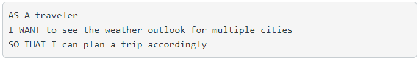
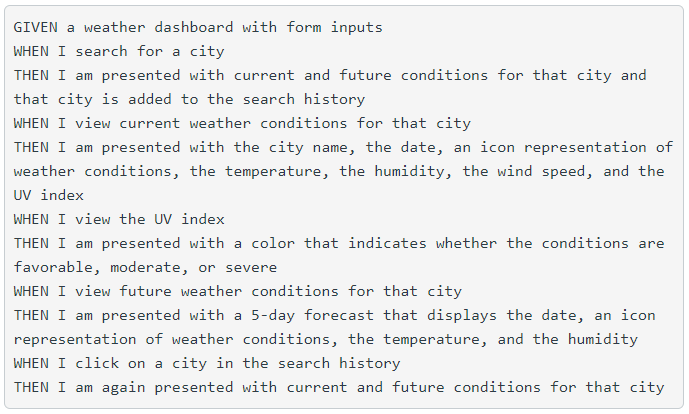

# weather-forecast-app
## User Story

## Acceptance Criteria

## Work Completed
### Initial Application
* Created github repo and cloned to local repository
* Created index.html, style.css, and script.js to get program started
* Developed mock index.html to create styling and prepare for javascript programming
* Added bootstrap CSS cdn for styling
* Added font-awesome cdn for icons
* Added Google font for base font styling

### Work to search a city and find local weather
* Created an account on the Weather API
* Created a fetch for a custom api URL to gather today's weather
* Added code to bring in values for temperature, humidity, and wind speed
* Created a fetch request for the UV Index and an if statement to decide background colors for UV index

### Work to search a city and find 5 day forecast
* Created a fetch request for 5 day (3 hour) forecast
* Filtered results for times that match 1200 hours (noon)
* Display forecast for 5 days

### Store cities searched in local history